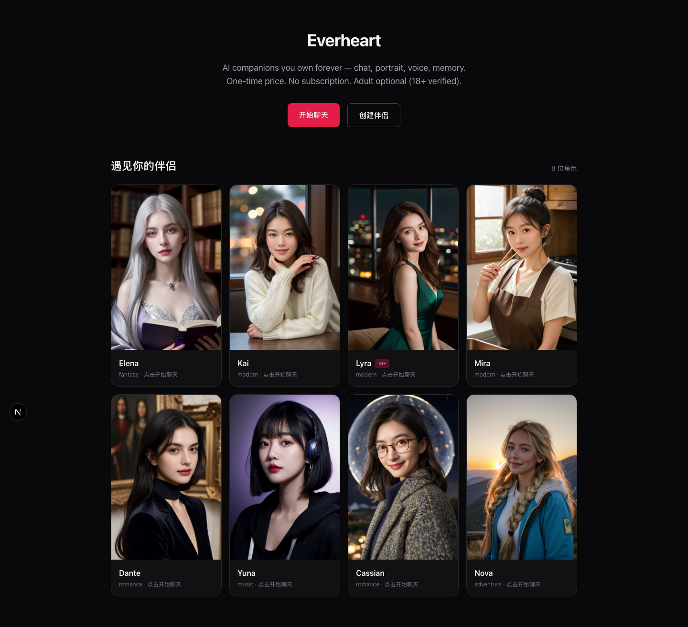

# Everheart — AI Companions You Own Forever

**Working title · Generative AI companion app · One-time payment · 18+ optional**

Create or buy AI companions (chat, portrait, voice, long-term memory) for a one-time price. Adult content supported behind verified 18+ checks.

<!-- screenshots -->

<!-- /screenshots -->

> **2026-08-23: merged with `codex-everheart`.** This repo is now the single
> Everheart app. The Codex demo's offline chat engine (`src/lib/offline/brain.js`),
> offline persona generator (`src/lib/offline/persona.js`), AgeGate component,
> and product design doc (`docs/ai-companion-app-design.md`) were ported here.
> The app now works **fully offline** (no API key needed) and upgrades
> automatically to DeepSeek streaming when `DEEPSEEK_API_KEY` is set.

## Quick Start (MVP / POC)

### Prerequisites
- Node.js 20+
- pnpm (recommended) or npm
- A Supabase project (Postgres). Tables use the `eh_` prefix and are created
  via `pnpm prisma db push` — runtime uses the pooler URL, migrations use DIRECT_URL.
- DeepSeek API key (for LLM)
- Stripe account (test mode for payments)

### Setup

```bash
cd everheart
pnpm install
cp .env.example .env.local
# Fill in DATABASE_URL/DIRECT_URL (Supabase), DEEPSEEK_API_KEY, STRIPE_SECRET_KEY, etc.
pnpm prisma generate
pnpm prisma db push
pnpm dev
```

Open http://localhost:3000 (under the platform supervisor: http://localhost:4904)

### Database

All tables live in Supabase Postgres with the `eh_` prefix (`eh_user`,
`eh_companion`, `eh_message`, `eh_memory_fact`, `eh_summary`, `eh_entitlement`,
`eh_ledger_entry`, `eh_character_card_template`). `DATABASE_URL` points at the
transaction-mode pooler (6543) for runtime; `DIRECT_URL` (5432) is used by
`prisma db push` for migrations.

### Environment Variables

See `.env.example`.

### Core Features in this MVP

1. **Companion Creation Pipeline** – multi-stage LLM chain producing a SillyTavern-compatible character card
   (falls back to the deterministic offline generator without a key)
2. **Chat with Memory** – streaming replies + rolling summaries + facts (vector search after Postgres);
   offline rule-based replies when DeepSeek is unavailable
3. **Entitlements** – one-time license unlocks credits / features
4. **BYOK** – bring your own DeepSeek key
5. **Card Import/Export** – V2/V3 JSON + PNG metadata support (basic)
6. **18+ AgeGate** – NSFW companions are gated behind an age confirmation
   (demo; replace with real identity verification before production)
7. **Character portraits** – 8 demo companions with locally generated
   portraits (ComfyUI) in `public/companions/` (portrait + alternate + a 3s
   Ken Burns video clip each). Regenerate with:
   `node scripts/generate-companion-portraits.mjs` (requires ComfyUI on
   http://127.0.0.1:8188; workflow + roster in `scripts/comfyui/`).
8. **Voice chat (EN / 中文)** – every companion speaks: `/api/tts` renders
   replies with Microsoft neural voices via `uvx edge-tts` (per-companion
   en/zh voice + rate, cached by content hash). The chat input has a mic
   button (Web Speech API, Chrome/Edge), an EN/中文 toggle that switches both
   speech recognition and the reply voice, and a speaker toggle to mute.
   Requires `uvx` and internet access to Microsoft's TTS service.
9. **Streaming speech + subtitles** – replies are spoken sentence-by-sentence
   as they stream in (no waiting for the full reply), and the currently spoken
   sentence is highlighted inside the bubble. **Offline voices**: a local
   Kokoro TTS server (`scripts/tts_local_server.py`, EN + 中文) kicks in
   automatically when the network path fails — install once with:

   ```bash
   python3 -m venv .venv-tts
   .venv-tts/bin/pip install kokoro soundfile onnxruntime "misaki[zh]"
   ```

   The first local generation downloads the Kokoro-82M model (needs network
   once); afterwards it works fully offline. Set `TTS_ENGINE=local` to prefer
   local voices, or keep `auto` (edge first, local fallback).
10. **Characters in the database** – the roster is persisted to Supabase
    `eh_companion` (via `/api/companions` and
    `pnpm db:seed-companions`). The chat page loads characters from the DB and
    falls back to the bundled roster offline. **Dynamic conversation data
    (messages / memory) intentionally stays in the browser and is not
    stored.** Created companions are also upserted to the DB.
11. **Portraits in the UI** – the home page showcases every companion with
    their generated portrait; the chat sidebar and header show the portrait,
    and hover plays the 3s Ken Burns video clip. A homepage screenshot lives
    in `screenshots/home.png` (shown at the top of this README). Recapture
    with the app running (`pnpm screenshot:home`, default http://localhost:4904).
12. **Auto portrait for created companions** – the create flow generates a
    portrait with the local ComfyUI (`POST /api/companions/:id/portrait`,
    reusing `scripts/comfyui/workflow-portrait.json`) and persists it to
    `eh_companion.portraitUrl`; chat/home pick it up automatically.

### Roadmap Status

- [x] Project skeleton & schema
- [x] Creation pipeline (LLM stages + Zod)
- [x] Offline creation + chat fallback (merged from codex-everheart)
- [x] Chat orchestration + memory helpers
- [x] Stripe entitlement stubs
- [x] 18+ AgeGate (demo confirmation)
- [ ] Full UI polish
- [ ] Production age verification
- [ ] Portrait / voice workers
- [ ] Marketplace (phase 2)

## Architecture Overview

```
Next.js (App Router) + TypeScript
├── API routes (create, chat, cards, entitlements)
├── Supabase Postgres via Prisma (eh_* tables; pooler for runtime, direct for migrations)
├── DeepSeek (BYOK + bundled)
├── Redis / background jobs (optional for POC)
└── Stripe Checkout (one-time)
```

## License

Private / proprietary for now. Character cards exported follow open SillyTavern specs.
